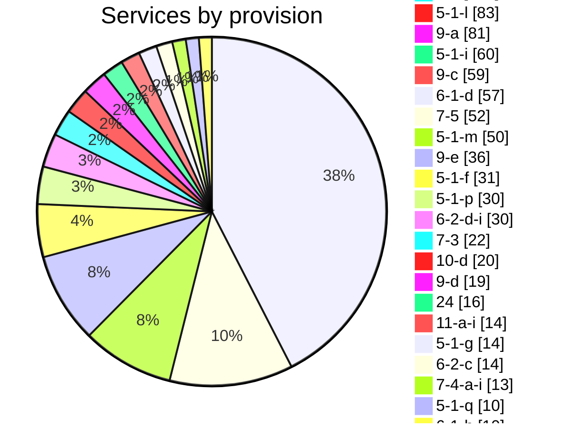
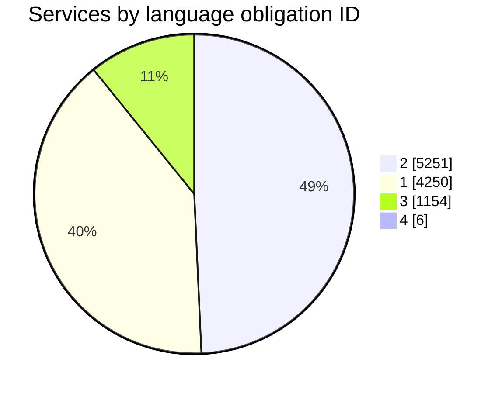
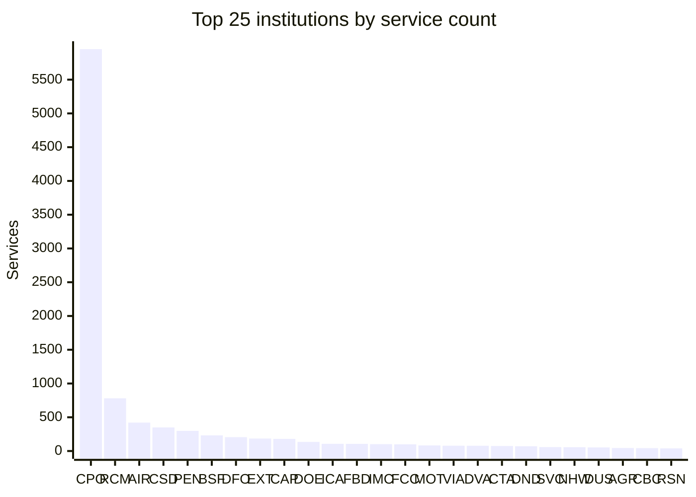

# Burolis bilingual data

This directory contains a weekly bilingual snapshot of the Treasury Board of
Canada Secretariat's [Burolis directory](https://www.tbs-sct.canada.ca/burolis). The scraper downloads all
English and French results, merges them on `serviceId`, and keeps separate
`_en` and `_fr` columns only when a field differs between the two languages.

## Current snapshot

Updated in UTC on **2026-09-23**. Change detected: **no**.

| Measure | Count |
| --- | ---: |
| English records | 10,661 |
| French records | 10,661 |
| Merged services | 10,661 |
| Institution codes | 195 |
| Provision values | 60 |

## Provision counts



## Language obligation ID



## Top 25 institutions by service count

Labels use the source `institutionCode` field.



## Data files

- `data/burolis_en.json`
- `data/burolis_fr.json`
- `data/burolis_bilingual.json`
- `data/burolis_bilingual.jsonl`
- `data/burolis_bilingual.csv`
- `data/burolis_timeseries.csv`

The time series has one row per UTC date. `change_detected` is `1` when either
language's row count or any record content changed from the prior snapshot, and
`0` otherwise. Multiple runs on the same date update one row; once a change is
detected that day's value remains `1`.

## Run locally

```bash
python -m pip install -r burolis/requirements.txt
python burolis/scrape_burolis.py
```

The scheduled GitHub Actions workflow runs on a GitHub-hosted Ubuntu runner.
Responses containing the TBS `Request Rejected` page are treated as failures,
so rejected or incomplete responses cannot replace the saved snapshot.
